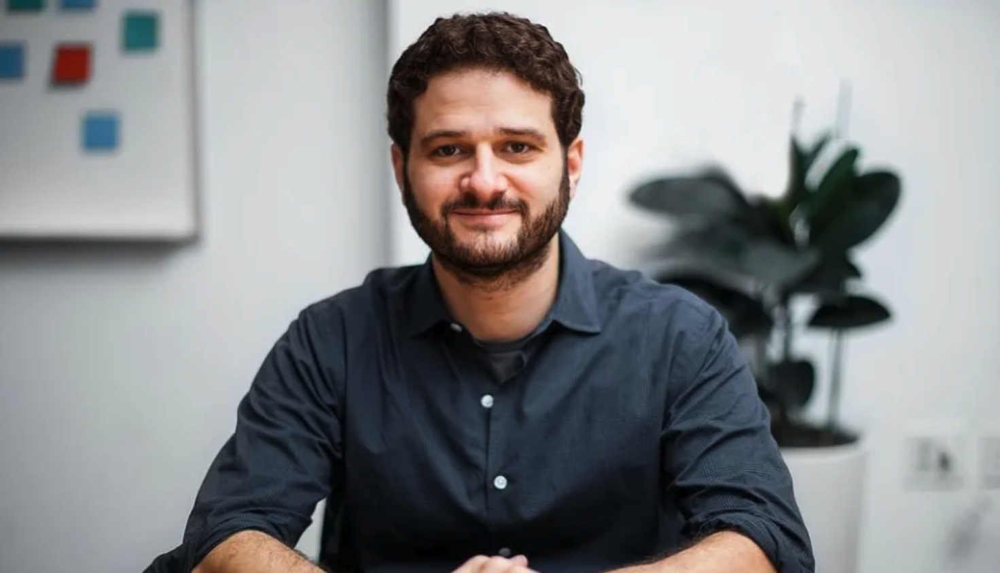

# Asana CEO: То, как мы работаем сейчас, скоро будет выглядеть как пережиток прошлого

Вот как Искусственный Интеллект сделает работу более человечной.

По мере того как И.И. все больше проникает в общественное сознание, мы начинаем видеть антиутопические истории о будущем работы, предсказывающие своего рода окончательную победу макиавеллиевских сил капитализма.

Самый яркий пример - автор научной фантастики Тед Чианг, который недавно [задался вопросом](https://www.newyorker.com/science/annals-of-artificial-intelligence/will-ai-become-the-new-mckinsey), есть ли "способ для И.И. сделать что-то еще, кроме как точить лезвие ножа капитализма?". По данным Insider, сотрудники JPMorgan, [возможно, уже страдают](https://www.businessinsider.com/jpmorgan-chase-employees-describe-fear-mass-workplace-data-surveillance-wadu-2022-5) от такой динамики благодаря мощным инструментам мониторинга сотрудников компании.

Эти истории рисуют мрачную картину, вызывая множество опасений, которые я разделяю, и, действительно, мои собственные опасения по поводу И.И. выходят далеко за рамки потенциального влияния на работу. Но я верю, что мы преодолеем их, и хочу на мгновение представить мир, где люди процветают на своих рабочих местах благодаря, а не вопреки И.И.

Вместо того чтобы представлять, как И.И. контролирует каждый момент вашего внимания, представьте, что он помогает вам максимально использовать моменты потока. Например, программное обеспечение может помочь вам отсеивать уведомления, грамотно анализируя, является ли входящее оповещение достаточно важным и срочным, чтобы прервать вашу концентрацию. Он может органично синхронизировать моменты совместной работы с другими людьми, уходя от сегодняшней жесткой системы повторяющихся встреч и блоков календаря, которые дробят ваши дни. И, пожалуй, самое главное - он может побудить вас делать перерывы и даже отпуска, когда вы слишком долго работаете (таким образом, помимо самочувствия, [повышается эффективность работы в течение длительных циклов](https://wavelength.asana.com/work-life-balance/)).

Мрачная версия будущего представляет людей как взаимозаменяемые с нашими программными аналогами, колесиками в машине. На самом деле мы лучше всего проявляем себя, когда занимаемся задачами, которые имеют ярко выраженный человеческий характер и позволяют нам проявлять творческие способности, сопереживать и оценивать. И.И. может сделать наши дни наполненными этими задачами, когда мы используем его сравнительное преимущество для выполнения большего количества "работы о работе", которая замедляет нас, например, составление и обмен статус-обновлениями.

Интернет помог сделать мир меньше и привычнее, и точно так же И.И. может ускорить процесс вхождения сотрудников в должность и освоения институциональных знаний, став персональным наставником, который введет каждого в курс дела с экспертным терпением и изяществом. Незнакомые аббревиатуры, пользовательские эмодзи в Slack, кодовые названия проектов - все эти мельчайшие нюансы, составляющие соединительную ткань культуры, могут вызывать отторжение у тех, кто с ними не знаком. И.И. может расшифровать культуру компании или команды, заменив неловкость, сопровождающую переходный период, быстро достигнутым чувством принадлежности и упростив задачу внесения вклада в достижение целей команды. Уменьшение этого трения расширяет возможности человека, позволяя ему легко покинуть менеджеров, которые плохо к нему относятся.

И наконец, истории, рожденные паранойей, учат вас видеть в И.И. абсолютный инструмент наблюдения, следящий за каждым вашим взглядом и движением мыши. Но что если вместо этого использовать его для того, чтобы уловить, что вы делаете хорошо, и укрепить доверие между менеджерами и сотрудниками?

Благодаря возможности составлять отчеты о ваших достижениях - или даже оценивать их качество - И.И. может помочь менеджерам лучше оценить результаты работы своих сотрудников, а не полагаться на количественные показатели, например время, проведенное за рабочим столом. Он может следить за сроками и критическими путями, автоматически направляя вас на выполнение самой срочной работы. А если вы отстаете от сроков, И.И. сообщит об этом вашему менеджеру - ему не придется постоянно совать свой нос в дела, чтобы уловить тот единственный случай, когда вы отстали. Благодаря тому, что И.И. помогает всем сосредоточить внимание на намерениях по выполнению работы, менеджеры могут вместо этого потратить свое время на инвестиции в способы поддержки своей команды и развития отдельных сотрудников.

То, как мы работаем сейчас, скоро будет выглядеть рудиментом, своего рода социальными лесами на нашем пути к созданию чего-то лучшего. Мы знаем, что И.И. изменит будущее работы. Будут ли будущие конструкции нашего труда строгими, брутальными башнями, бездушно перерабатывающими ресурсы? Или это будут прекрасные, замысловатые памятники росту и процветанию?

Мы можем влиять на то, как будет развиваться это будущее, но мы сможем воплотить в жизнь нечто замечательное, только если будем создавать позитивное видение того, что возможно. Мир, в котором будет больше прорывов, больших идей, лучшего исполнения и быстрого прогресса. Мир, полный счастливых людей, живущих своей лучшей жизнью на работе.

Когда мы с моим соучредителем основали Asana, нас вдохновляла сила команд. Когда глобальные команды работают вместе, мы можем делать великие вещи - такие, которые способствуют улучшению жизни людей и планеты.

Клиенты должны требовать позитивной версии будущего. Технологи могут его построить. И.И. и люди могут совместно создавать это будущее. Вместе мы сможем полностью реализовать наш коллективный потенциал.
